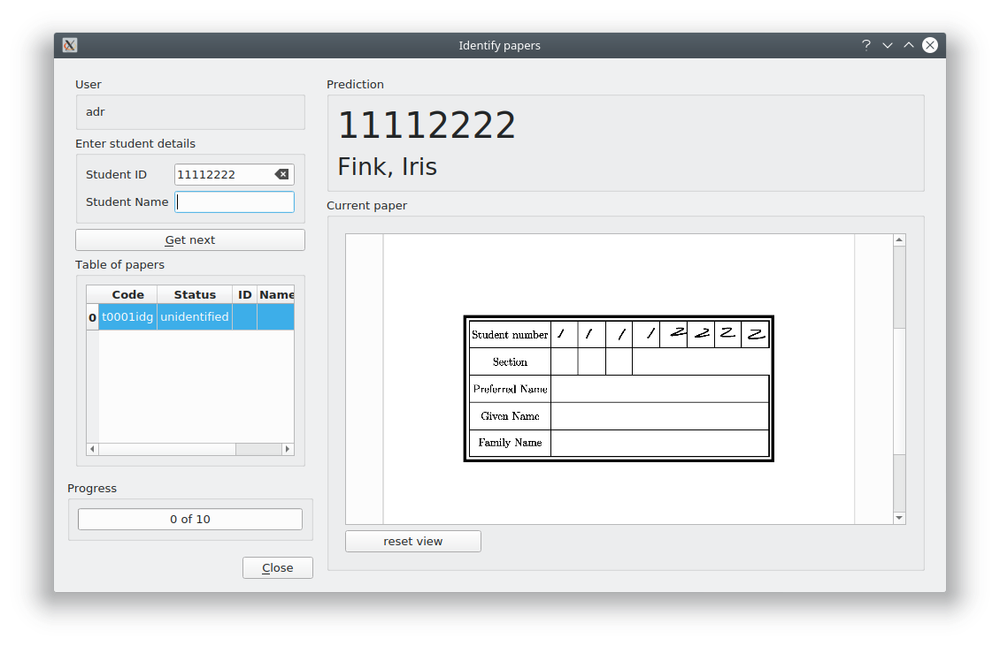

<!--
__author__ = "Andrew Rechnitzer"
__copyright__ = "Copyright (C) 2018-9 Andrew Rechnitzer"
__license__ = "GFDL"
 -->

# Identifying papers
## A little background first
* When the test papers are produced every page of every test is stamped with unique QR-codes that identify them. The code is of the form TxxxxPyyVz - where xxxx is the test number, yy is the page number and z is the version of that page.
* Hence it is easy (barring scanning mishaps) to reconstruct a paper from the scans of its individual pages - even if those scans are completely out of order. It is, however, a harder computing problem to determine *whose* paper it is.
* MLP can use a (buzzword compliant) neural-network to read student numbers from the front page of tests (providing they use the provided template) and so predict which student number in the class list is mostly likely to be matched to the current paper. It appears to do this with very high accuracy.

* Unfortunately, MLP does not yet do a good job of predicting which of its predictions are poor. Hence we have to match a given paper to a given student - this is where you come in. We need you to read student numbers off the front page of tests.
* It is a little tedious, but it is pretty quick and easy.

## Identifier window
* A couple of moments after clicking "start" on the launch page, a window should pop up that looks like this:

* On appearing, the window should already be populated with an ID-page of a test, and (if predictions have been made), the predicted student number / name in large letters.
* If the page-image is too small, then you can left-click on it to zoom in, and right-click to zoom-out.
* We recommend that you identify papers by the student-number rather than student-name.
* If predictions have been made then the student-number text-box will have been filled in already. If not, then you can enter the number in that box and a pop-up auto-completer should appear. The pop-up is populated (all going well) by data from the class list.
* Once you've entered the number (or name), then hitting enter will pop up a "Are you sure" window (just in case). Hitting enter again will accept the result.
* The next ID-page should be automatically loaded and you can continue.
* If you need to go back to re-ID a page then you can simply click on that page from the "table of papers" and re-enter the data.
* If the system does not recognise the student-number we recommend that you tell your IIC (though there is the option to enter unrecognised student number / name pairs).

## Please close the window
* We recommend that you close the window when you leave your computer for more than a few minutes. This makes sure that any un-ID'd papers you have locally are released back to the server and so they can be ID'd by other users.
* When you fire up the launch window again it will remember the data you entered previously and you should only have to enter your password.
