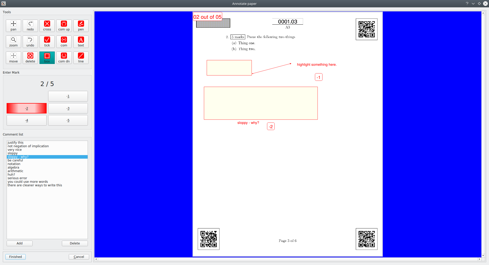

# Marking papers
## The two windows
* The software for marking consists of two windows
  * Listing window
  * Annotation window

## Listing window
* A couple of moments after clicking "start" on the launch page, a window should pop up that looks like this:

* In the top-left there is basic information about the user, the page-group, version and the maximum mark for that page-group.
* The list of papers shows the code of the page-groups you are marking (and have marked). The "previous" and "next" buttons just move you up and down this list. These buttons will likely be removed in the future since you can just click or use arrows.
* The next three buttons are perhaps the most important
  * *Get next* - requests another page-image from the server. As you annotate the software should automatically get the next image for you, but you can also click this.
  * *Revert* - takes a marked page-image and wipes it clean - reverting it to its unmarked state. Handy if you make a mistake.
  * *Annotate & mark* - this fires up the annotation window (more on this shortly).
* Marking styles - These change the behaviour of marking in the annotation window. I recommend using either *mark up* or *mark down*.
  * *Mark up* - the system assumes that the page-image starts with a mark of zero and then you can incrementally assign non-negative marks (0,+1,+2,+3,+4,+5) to the page. So, for example, if the page has two parts, each out of 3 and the student gets marks of 1 and 3 (respectively), then you can stamp "+1" next to the first, and "+3" to the second, and the system will total the marks for you.
  * *Mark down* - the system assumes that the page-image starts with the maximum possible mark and then you decrement marks (-1,-2,-3,-4,-5) as you find mistakes. So, for example, if the page has two parts, each out of 3 and the student gets marks of 1 and 3 (respectively), then you can stamp "-2" next to the first, and leave the second part alone (though maybe you'll put a tick there).
  * *Total* - you don't assign part-marks, instead you click on the total mark.
  * *Later* - instead of choosing now, you can choose the marking style inside the annotation window.
* In an attempt to make annotation as efficient as possible, I have tried to set things up so that you can keep one hand on the keyboard (to choose annotation tools), and one hand on the mouse. Rather than inflicting the tyrrany of the majority onto the left-handed, you can choose which is your mouse hand.
  * The choice changes the layout of the annotation window, and in particular it changes the keyboard shortcuts for the tools.
  * The tools are mostly set up for right-handed people, but I have done my best to accommodate a left-handed setup. Not everything is easily mirrored (eg mark numbers), so I am happy to get feedback on it.
  * The keyboard shortcuts mean that you can keep the mouse-pointer over the page-image as much as possible, and not have to move back and forth to the tools. This is supposed to make the annotation window closer to the experience of using a pen hovering over a page.
  * Of course, this requires you to become more fluent with the (one-handed) keyboard short-cuts, but we'll get to that when we get to the annotation window.
* The image of the current page-group is displayed on the right.
  * You can left-click to zoom in and right-click to zoom out.
  * The *reset view* button returns to the original (fit me to the window) view.
  * The *flip pages* button allows you to fix the orientation of the page images. The software does a pretty good job of ensuring that each page image is the right way up, but errors do happen. This button fires up a new window to allow you to flip pages 180-degrees. You shouldn't need this.

### Please close the window
* Again - we recommend that you close the window when you leave your computer for more than a few minutes. This makes sure all data is saved on the server.
* The close button closes does this.
* When you fire up the launch window again it will remember the data you entered previously and you should only have to enter your password.

## Annotation window.
* Here is the right-hand mouse version with *mark down* selected:

* And here is the left-hand mouse version with *mark up* selected:

* In both cases there is 5x3 bank of tool buttons (more on those in a moment), some marking buttons, a bank of standard comments and "finished" and "cancel" buttons.
* *Finished* accepts your annotations and marks and bounces you back to the paper-listing window. That window should automatically load a new page-image for you. You can then just type "enter" again to fire up the annotation window.
* *Cancel* bounces you back to the paper-listing window without recording either your annotations or marks.
* Note that the "+" and "\" keys will maximise (un-maximise) the annotation window.

### Tools
* You can get a listing of all the key-codes by typing a question-mark.
* In both layouts the tools are arranged so that the most common tools (based on my experience) are arranged in the middle row. The keyboard shortcuts correspond to the keys along the "home-row" of a qwerty keyboard.
  * In the right-hand mouse version A, S, D, F and G  correspond to zoom, undo, tick, comment and text (respectively).
  * In the left-hand mouse version h,j,k,l and semi-colon correspond to text, commend, tick, undo and zoom (respectively).
  * The top row of tools correspond to the keys above the home-row. ie, qwert and yuiop.
  * The bottom row of tools correspond to the keys below the home-row. ie, zxcvb and n m comma period slash.
* The tools are (I hope) pretty obvious, but with a few idiosyncracies
  * *Pan* - clicking and dragging moves the page image.
  * *Zoom* - left-click to zoom in and right-click to zoom out.
  * *Move* - allows you to move your annotations around
  * *Undo / redo* - the annotation window has a full (or very full) undo/redo stack
  * *Delete* - delete the annotation you click on (this can be a bit fussy, so you might have to click carefully to delete thin objects like lines)
  * *Cross / Tick* - places a cross or tick on the page. Notice that if you have the tick tool selected, then the left mouse-button will create a tick, while the right mouse-button will create a cross. If you have the cross tool the reverse happens.
  * *Box* - click and drag with the left mouse-button will create a high-light box. Click and drag with the right mouse-button will create an opaque white box. You should not need the white box much.
  * *Comments* - these three buttons select from and move up/down the comment-list. After you have selected a comment, a left-mouse click pastes the comment into the page-image. After that the pasted comment can be treated like any other text object and the text tool will let you edit it. The system saves your comments between sessions (in a json file).
    * You can create and delete comments by using the obvious buttons.
    * You can also edit existing comments by double clicking on them.
    * You can reorder the comments by click-dragging up and down the list.
  * *Pen* - dragging with left mouse-button creates a free-hand red path, while the right mouse-button creates a thick yellow highlight-path.
  * *Text* - a simple text tool. To exit the text tool you press escape (not return or enter), or double-clicking will start a new text object under your click. You can also go back an edit previous text by clicking on it.
  * *Line* - dragging with left mouse-button creates a straight-line, while the right mouse-button creates a similar arrow.

### Assigning marks

* Perhaps the easiest way to assign marks is to use either the *mark up* or *mark down* methods.
* In mark-up you can assign 0,+1,+2,+3,+4 or +5 marks. Clicking on the appropriate button or pressing 0,1,2,3,4 or 5 (and also the single-quote key to get 0), and then left-clicking on the page will stamp that onto the page (with a little box around it).
* In mark-down you assign -1,-2,-3,-4 or -5 marks. Again the button or pressing 1,2,3,4 or 5 and then left-clicking on the page stamps the page.
* To all the left-handers out there - sorry I am not sure which keys I should assign these to. I am very happy to get feedback and I'll get it into the system.
* In both cases the mark (stamped in the top-left of the page) is updated. These also work correctly with the undo/redo and delete tools.
* In mark-total, the user simply clicks the appropriate button for the total-mark and the mark is updated accordingly.

### Done marking
* If you don't like you annotations or mark, then you can click the cancel button and the system will return you to the paper-listing window.
* More generally, once you are finished marking you can type alt-enter and the system will accept your annotations and mark.
  * If you are marking-up and have assigned a mark of zero then the system will ask you to confirm.
  * If you are marking-down and have assigned full marks, then the system will also ask you to confirm.
* After you bounce back to the paper-listing window the system will save your results and automatically request the next page-image. Press enter and the annotation window will fire up on this new page-image.
