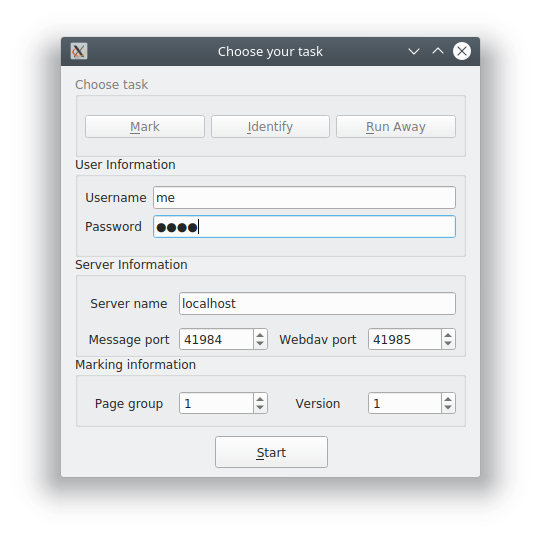

<!--
__author__ = "Andrew Rechnitzer"
__copyright__ = "Copyright (C) 2018-2019 Andrew Rechnitzer"
__license__ = "GFDL"
 -->
# Starting the MLP client
## Permissions and clicking
 * Linux and OSX - you might need to make sure that the file is executable, using the following command in a terminal
 ```
 chmod u+x ./client_linux
 ## or
 chmod u+x ./client_osx
 ```
 and then run it from the same terminal via
 ```
 ./client_linux
 ## or
 ./client_osx
 ```
The name of the files might be slightly different (eg they might include a date or a build number).

 * Windows - you should be able to just double click on the file. You might need to click through a few warnings about whether or not the file is to be trusted.

## Launch window
* The client might take up to a few seconds to start. This is because it is really a compressed bundle python code and enough libraries to run everything. When it runs it starts by unpacking itself into a temporary directory and then firing up the code. This can take a few moments. Sorry.

* Then you'll be presented with a window like this: 

* After you have picked your task you need to enter some name and server data:
  * *username* and *password* - should be supplied to you by the IIC, and I hope is pretty obvious what it means.
  * *server name* - this is the name of the computer that is running the software that handles all the page images and data. Again - the IIC will tell you what this is.
  * *Ports* - these are the ports used by the software to communicate with your client. You don't need to change these unless the IIC tells you to do so.
  * If you are marking papers (which almost certainly you will be) then you also need to enter the following
  * *Page group* - the basic chunk of a test that you will mark is a page-group. In many cases this will just be a single page of the test. However, sometimes a page will have multiple questions on it, and sometimes a question might extend over multiple pages. Hence MLP refers to "page-groups" rather than "pages" or "questions". Your IIC will tell you what page group you are assigned to mark.
  * *Version* - since classrooms are crowded, almost certainly the instructors have given multiple versions of the test to their students. The MLP software will present you with just one version of the page group to which you have been assigned. Your IIC will tell you which version you are to mark.
  * *Font size* - if the displayed font is too big or too large, then please change it here (and click the *set font* button). This will propagate through the rest of the app.

* There are 3 possible tasks
    * *Mark* - this will fire up the marking window which allows you (as the name implies) to mark and annotate pages. You will spend most of your time on this task.
    * *Identify* - this will fire up the test-identifying window.
    * *Total* - this will fire up the test-total window
    * *Close* - this (unsurprisingly) closes the client.


 * Click one.
